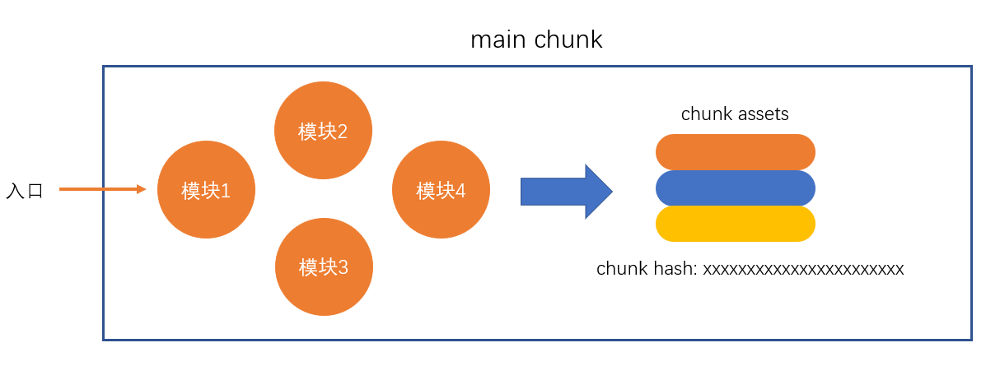

# webpack 

## 如何在浏览器端实现模块化？

### 问题

- 效率问题：精细的模块划分带来了更多的 js 文件，更多的 js 文件带来了更多的请求，降低了页面访问效率。
- 兼容性问题：浏览器只支持 es6 模块化，不支持 CommonJS(第三方模块，例如：axios)   
- 工具问题：浏览器不直接支持 npm 下载的第三方包
- (非业务类)工程问题......

> 根本原因是在 node 端，可以本地读取文件，效率比浏览器远程传输文件高的多。在浏览器端开发时态(devtime)和运行态(runtime)的侧重点不同。

- 开发时态
  - 支持多模块标准 es6、CommonJS
  - 模块划分精细一点
  - 不考虑兼容性问题
- 运行时态
  - 文件少一点（合并多个相同类型文件）
  - 体积小一点（代码别换行了，名称简写）
  - 代码内容乱一点（别人看不懂代码）
  - 执行效率问题

### 解决办法

- webpack 构建工具 
- grunt gulp fis browserify ...... 

> 官网：https://www.webpackjs.com/  

基于 nodeJs ,以开发时态的一个入口文件，分析模块的依赖关系（利用模块化导入语句 ），经过一系列的过程（压缩合并），最终生成运行时态的文件。

## 编译结果分析

### 模拟编译结果

```js
// 全局变量污染
const modules = {
  "./src/a.js": function(module, exports, require) {
    // xxx;
    // module.exports = 'a'
    // exports.a = 'a'
    // require('./b'); => require('./src/b.js')
  },
  "./src/b.js": function() {
    // xxx;
  }
}

// 专门写一个函数来运行
(function (modules) {
  // 提供 require 函数, 相当于运行一个模块，并得到导出结果 moduleId 模块路径
  function require(moduleId){
    var func = modules[moduleId];
    // 构造一个 module
    var module = {
      exports: {}
    }
    // 运行模块
    fnc(module, module.exports, require);
    // 得到模块返回结果
    return module.exports;
  }
  // 执行入口模块
  require('./src/index.js');  
})({
  "./src/a.js": function(module, exports, require) {
    // xxx;
    // module.exports = 'a'
    // exports.a = 'a'
    // require('./b'); => require('./src/b.js')
  },
  "./src/b.js": function(module, exports, require) {
    // xxx;
  }
});
```

- 为什么使用 eval 函数？
  - 便于定位错误信息。简易版 source map 。

## 配置文件

- webpack.config.js
- 命令行中的` --config `来指定配置文件。
- 通过 CommonJS 模块导出一个对象。

### 为什么这里不能使用 es6 导出配置文件呢？

- 打包的过程中，是在 node 环境下，会读取配置文件内容，会**运行**一次配置文件，相当于`const config = require('./webpack.config.js')`。我们自己的代码在打包过程中是不运行的，所以支持多模块。

- `mode: "development" mode: "production"`

### devtool 配置

- source map 
- webpack 中的 source map

  - 希望看到源码中的错误，而不是打包后的文件中的错误。chrome 率先支持了 source map 。没有兼容性问题，因为是开发者调试用的。。。
  - 多一个配置文件，浏览器发现 source map ,会找这个配置文件，文件中记录了原始代码以及转化后的代码的对应关系。
  - 不应在生产环境使用，source map 文件比较大，不仅会导致额外的网络传输，还会暴露原始代码。要调试真实的生产环境的代码，也需要做一些规避网络传输和代码暴露的问题。

## 编译过程

- 整个过程大致分为三个步骤：
  - 初始化
  - 编译
  - 输出
  


### 初始化

- 此阶段，webpack 会将**CLI 参数、配置文件、默认配置**进行融合，形成一个最终的配置对象。
- 对配置的处理过程是依托一个第三方库 yargs 完成的。
- 此阶段相对比较简单，主要是为接下来的编译阶段做必要的准备。
- 目前，可以简单的理解为，初始化阶段主要用于产生一个最终的配置。

### 编译

#### 1.创建chunk

- chunk 是 webpack 在内部构建过程中的一个概念，译为块，它表示通过某个入口找到的所有依赖的统称。
- 根据入口模块（默认为./src/index.js）创建一个 chunk 。
  
  

- 每个 chunk 都有至少两个属性：
  - name：默认为 main
  - id：唯一编号，开发环境和 name 相同，生产环境是一个数字，从0 开始

#### 2.构建所有依赖模块

 

```js
// ./src/index.js
console.log('index');
require('./a.js');
require('./b.js');

// ./src/a.js
require('./b.js');
console.log('a');
module.exports='a'; 

// ./src/b.js
console.log('b');
module.exports='b'; 
```
- ./src/index.js 出发，dependencies 中保存 `['./src/a.js', './src/b.js']` , `['./src/b.js']` 
- 替换依赖函数
  
```js
// 模块id : ./src/index.js
// 转化后的代码
console.log('index');
__webpack_require__('./src/a.js');
__webpack_require__('./src/b.js');

// 模块id : ./src/a.js
// 转化后的代码
__webpack_require__('./b.js');
console.log('a');
module.exports='a'; 

// 模块id : ./src/b.js
// 转化后的代码
console.log('b');
module.exports='b'; 
```
- 保存生成后的列表

  > AST在线测试工具：https://astexplorer.net/

- 简图:

  

#### 3.产生chunk assets

- 在第二步完成后，chunk 中会产生一个模块列表，列表中包含了模块 id 和模块转换后的代码。 
- 接下来，webpack 会根据配置为 chunk 生成一个资源列表，即 chunk assets，资源列表可以理解为是生成到最终文件的文件名和文件内容。
  
  

  > chunk hash 是根据所有 chunk assets 的内容生成的一个 hash 字符串。  hash：一种算法，具体有很多分类，特点是将一个任意长度的字符串转换为一个固定长度的字符串，而且可以保证原始内容不变，产生的 hash 字符串就不变。

- 简图：

  

#### 4.合并chunk assets

- 将多个 chunk 的 assets 合并到一起，并产生一个总的 hash .

  

### 输出 emit

此步骤非常简单，webpack 将利用 node 中的 fs 模块，根据编译产生的总的 assets ，生成相应的文件。

  

### 总过程

  

  

### 补充

- module：模块，分割的代码单元，webpack 中的模块可以是任何内容的文件，不仅限于 JS
- chunk：webpack 内部构建模块的块，一个 chunk 中包含多个模块，这些模块是从入口模块通过依赖分析得来的
- bundle：chunk 构建好模块后会生成 chunk 的资源清单，清单中的每一项就是一个 bundle，可以认为 bundle 就是最终生成的文件
- chunkhash：chunk 生成的资源清单内容联合生成的 hash 值
- chunkname：chunk 的名称，如果没有配置则使用 main
- id：通常指 chunk 的唯一编号，如果在开发环境下构建，和chunkname 相同；如果是生产环境下构建，则使用一个从 0 开始的数字进行编号
 


        